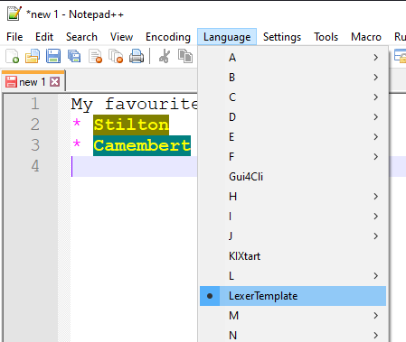
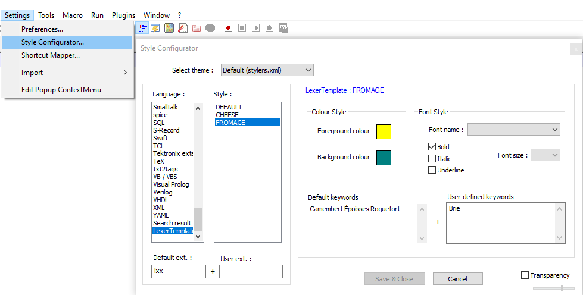

# Notepad++ plugin with crude external lexer.

Minimal changes to standard C++ [Notepad++ plugin template](https://github.com/npp-plugins/plugintemplate) to figure out how to implement an external lexer.

Neither [Scintilla](https://www.scintilla.org/ScintillaDoc.html) or [NPP](https://npp-user-manual.org/docs/plugin-communication/) provide much documentation on how to create a lexer - let alone an external one!

For the actual lexing part I suggest looking at the built in [NPP lexers source](https://github.com/notepad-plus-plus/notepad-plus-plus/tree/master/scintilla/lexers).
### Disclaimer
My C++ is... crusty.

### Notes
`LexerTemplate.vcxproj` file sets  `<PlatformToolset>` = v142 for Visual Studio 2019.

Interface functions required for NPP to use the lexer are declared with...
`extern "C" __declspec(dllexport) ... __stdcall`
but still needed an exports.def file to work (I assume something to do with name mangling).

`src\scintilla` is unmodified header files copied from [NPP\Scintilla\include](https://github.com/notepad-plus-plus/notepad-plus-plus/tree/master/scintilla/include)

`src\lexlib` contains required files copied from [NPP\Scintilla\lexlib](https://github.com/notepad-plus-plus/notepad-plus-plus/tree/master/scintilla/lexlib) - unchanged other than commenting out some headers that were not required.

`src\Lexer\Config\LexerTemplate.xml` defines the language keywords & styles. See NPPs lang.xml and stylers.xml for inspiration.

### Install
Copy the plugin dll to `plugins\LexerTemplate\LexerTemplate.dll`
and the xml file to `plugins\Config\LexerTemplate.xml`
"LexerTemplate" should appear:
In *Language* menu...

At the bottom of *Settings -> Style Configuration*...

